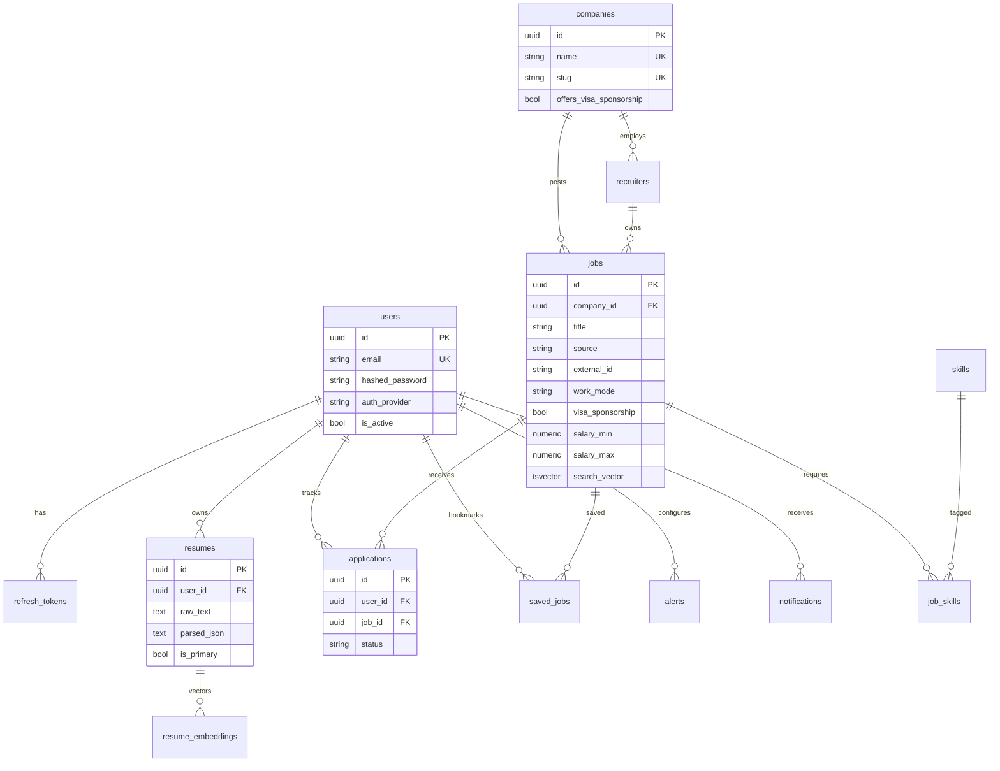

# Entity Relationship Diagram

## Core tables (Phase 1+)

| Table | Purpose |
|-------|---------|
| `users` | Accounts & preferences |
| `refresh_tokens` | Secure sessions |
| `companies` | Employer profiles |
| `recruiters` | Hiring contacts |
| `jobs` | Normalized postings + FTS |
| `job_skills` | Job ↔ skill M2M |
| `skills` / `technologies` | Taxonomies |
| `resumes` / `resume_embeddings` | Phase 2 |
| `applications` / `saved_jobs` | Tracking |
| `alerts` / `notifications` | Phase 4 |
